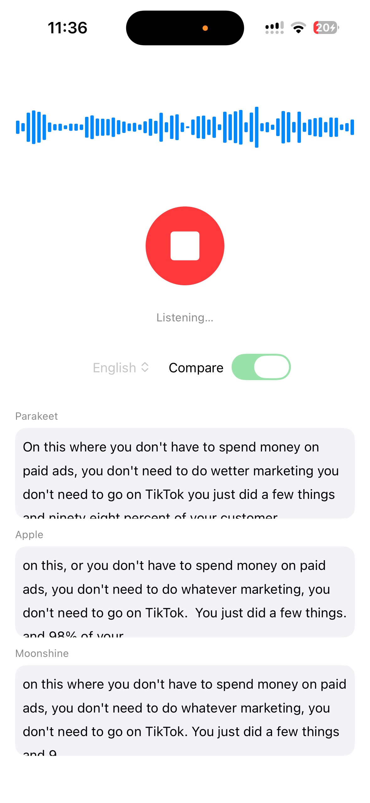

# 🦜 parakeet.cpp iOS demo

Live, **on-device streaming speech-to-text** on iOS, built on
[parakeet.cpp](https://github.com/mudler/parakeet.cpp). Tap the mic, speak, and the
transcript streams onto the screen — waveform on top, mic button in the middle,
transcript at the bottom, with a one-tap copy button per pane. Includes a
**compare mode** that runs Parakeet next to Apple's `SpeechTranscriber` (iOS 26)
and [Moonshine](https://github.com/moonshine-ai/moonshine-swift) side by side.

> **Community example — not maintained or tested by the parakeet.cpp core team**
> (they have no Apple toolchain). Best-effort, maintained here.

<p align="center">
  
</p>

## How it links to parakeet.cpp

parakeet.cpp is a **pinned git submodule** at `third_party/parakeet.cpp`.
`scripts/build_xcframework.sh` compiles `libparakeet` (+ ggml, Metal) from it into a
static `Parakeet.xcframework` for device + simulator. The app drives the streaming
C-API (`parakeet_capi_stream_*`) over mic audio captured with `AVAudioEngine` and
resampled to 16 kHz.

## Requirements

- **Full Xcode** (not just Command Line Tools) — needed for the iOS SDK and the
  Metal toolchain (run `xcodebuild -downloadComponent MetalToolchain` if the metal
  compiler is missing).
- [XcodeGen](https://github.com/yonaskolb/XcodeGen) (`brew install xcodegen`).
- An iPhone (A16+ recommended for the 0.6B model in real time) and an Apple ID for signing.

## Quick start

```sh
git clone https://github.com/Kashif-E/parakeet-ios-demo
cd parakeet-ios-demo
./setup.sh                       # downloads prebuilt framework + models, generates the project
open ParakeetDemo.xcodeproj      # set your signing Team, pick your iPhone, Run
```

`setup.sh` fetches the prebuilt `Parakeet.xcframework` (from the latest release),
the Parakeet model (~685 MB) and Moonshine `base-en`, then runs XcodeGen — **no
submodule, no Metal toolchain, no cross-compile.** All you add is your Apple
signing Team in Xcode (required for any on-device iOS app).

## Build from source (optional)

To build the framework yourself instead of downloading it:

```sh
git clone --recursive https://github.com/Kashif-E/parakeet-ios-demo   # --recursive for the submodule
cd parakeet-ios-demo
./scripts/build_xcframework.sh   # needs full Xcode; -> vendor/Parakeet.xcframework
./scripts/generate.sh
# then add models per "Models" below, open, Run.
```

## Models

GGUFs are on Hugging Face — **[kashif3314/nemotron-3.5-asr-streaming-0.6b-gguf](https://huggingface.co/kashif3314/nemotron-3.5-asr-streaming-0.6b-gguf)**
(unofficial, converted with parakeet.cpp; weights are **OpenMDW-1.1**):

| file | recipe | size | stock parakeet.cpp? |
| ---- | ------ | ---- | ------------------- |
| `…-q4_k.gguf` | q4_k linear, **F32** rest | ~685 MB | ✅ **use this** |
| `…-q4k-f16.gguf` | q4_k linear, f16 rest | ~486 MB | ⚠️ patched build only |
| `…-q4k-q8.gguf` | q4_k linear, q8_0 rest | ~460 MB | ⚠️ patched build only |

Download the **q4_k** file and save it as `ParakeetDemo/Resources/model.gguf` — it
loads on the vanilla pinned submodule, no patch needed.

For **compare mode**, also fetch Moonshine `base-en` (`encoder_model.ort`,
`decoder_model_merged.ort`, `tokenizer.bin`) from
[moonshine-ai/moonshine](https://github.com/moonshine-ai/moonshine) into
`ParakeetDemo/Resources/base-en/`.

### Smaller models (optional — needs the loader patch)

The `q4k-f16` / `q4k-q8` files store the non-matmul tensors (conv/LSTM/featurizer/
norm) in reduced precision (~30 % smaller, **WER 0 vs NeMo** on tested clips) and
rely on a load-time dequant that isn't in released parakeet.cpp yet. To use them,
apply **`parakeet-rest-loader.patch`** (also in the HF repo) to the submodule before
building:

```sh
cd third_party/parakeet.cpp
git apply /path/to/parakeet-rest-loader.patch     # adds: quantize --rest f16|q8_0 + load-time dequant
cd ../.. && ./scripts/build_xcframework.sh
```

The patch modifies MIT-licensed parakeet.cpp and is provided under the same MIT license.

## Compare mode

Toggle **"Compare"** to run three engines on the same mic audio, stacked:
**Parakeet** (this) · **Apple `SpeechTranscriber`** (iOS 26, system) · **Moonshine**
(SPM package, bundled `base-en` model). Each pane has a copy button. Useful for
judging accuracy, punctuation, number formatting, and latency for your use case.

## Notes

- Uses a **stock parakeet.cpp model** so it builds from the vanilla pinned submodule
  with no extra patches. (A smaller `q4_k + q8-rest` build exists but needs a
  load-time dequant patch; not used here.)
- The framework embeds the Metal shaders (`EMBED=ON`) so it's self-contained — no
  Metal toolchain or submodule needed to use it. Shaders compile once at first
  launch (a few seconds, behind the loading state).
- The model must be a **streaming** model (`nemotron-3.5-asr-streaming-0.6b` or
  `parakeet_realtime_eou_120m-v1`); offline-only GGUFs fail `stream_begin`.
- Models are gitignored — you supply them per steps 3–4.

## Licenses

- App code: MIT (this repo, `LICENSE`).
- [parakeet.cpp](https://github.com/mudler/parakeet.cpp): MIT (submodule).
- Model weights follow each model's own license (e.g. NVIDIA nemotron is
  OpenMDW-1.1; Moonshine per its repo). Apple `SpeechTranscriber` is a system framework.
